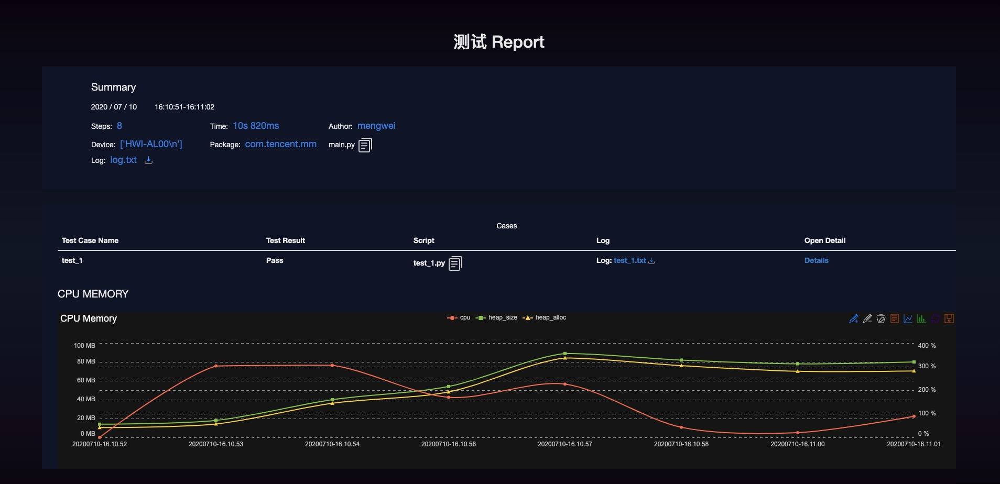

# airrun

致力于简单快速的在 `Android` 设备上运行 `airtest`，减少在构建用例、获取性能监控、日志获取方面的复杂度，
并提基于 `airtest` 报告的新的报告生成工具，让测试人员更专注于编写测试用例。


- Python Version >= 3.6


## 介绍

- 用例分层和封装
- 模板封装
- 执行时区分用例
- 监控 cpu、memory 信息
- 输出图表
- 统计信息图表
- 重写 log 手机
- 重写报告生成

## 安装

- pip install airrun

```shell
pip install --upgrade airrun
```

## 使用

```shell script
python -m airrun 
    version             show version and exit
    run                 run script
    info                get & print author/title/desc info of script
    report              generate report of script
```

### 参数

支持 run 方法

```shell script
python run --package=com.tencent.mm --device=yourdevice
```

## 用例编写

查看 `testcase` 目录

| name | desc | remark |
|----|----|----|
| config | 本地配置 | |
| pages/resource | 存放 资源文件 | |
| page/*.py | 具体的页面信息 | |
| main.py | 默认运行的 script 文件 | |
| test_1.py | 给出的测试用例文件 | |

- 添加用例 

```python
import logging

from airtest.core.api import *

from airrun.common.marks import airrun_setup
from testcase.config.config import LocalSetting
from testcase.pages import main_page_template

logger = logging.getLogger(__name__)

__author__ = "mengwei"
__title__ = "Case 1"
__desc__ = """
DEMO
"""


# 1 使用 airrun_setup 时，要传入测试的 package，测试的名称，全局不能重复
@airrun_setup(package_name=LocalSetting.APP_PACKAGE_NAME, test_name="test_1", login_func=None)
def test_1():
    start_app(LocalSetting.APP_PACKAGE_NAME)
    time.sleep(5)
    main_page_template.dao_hang_template.tmplt_wo_de.assert_exists()
    main_page_template.dao_hang_template.tmplt_wo_de.click()
```


### 分层

### 编写

## 报告生成

基于 airtest 的报告生成，增加了每个用例的信息和全局的信息，支持自定义添加



### 基于设备的报告


